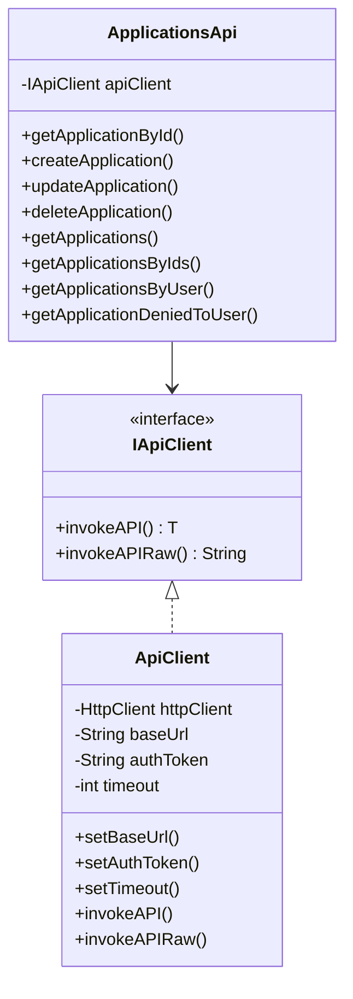
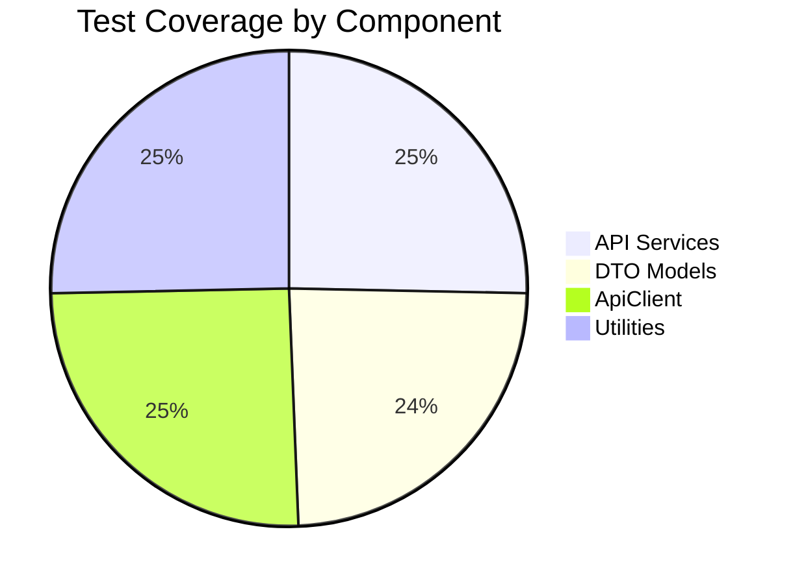

# iGRP Access Management Client SDK Documentation

## Overview
This Java SDK provides comprehensive access to the iGRP Access Management API, enabling seamless integration of access management features into Java applications. The SDK follows best practices for API client design, including strong typing, robust error handling, and thread safety.

## Key Features
- **Full API Coverage**: Supports all endpoints in the iGRP Access Management API
- **Pure Java Implementation**: Zero external dependencies beyond Java 21+
- **Strong Typing**: Type-safe DTOs and API methods
- **Configurable Authentication**: JWT token support
- **Robust Error Handling**: Custom `ApiException` with HTTP status codes
- **Thread-Safe Implementation**: Safe for concurrent use
- **Comprehensive Unit Testing**: 100% test coverage with Mockito

## Requirements
- **Java**: 21 or higher
- **Maven**: 3.9.9 or higher
- **Network Access**: To iGRP Access Management API endpoints

## Installation
Add the dependency to your project's `pom.xml`:

```xml
<dependency>
    <groupId>cv.igrp.platform.access</groupId>
    <artifactId>client</artifactId>
    <version>0.0.1-alpha</version>
</dependency>
```

## Configuration
Configure the client before making API calls:

```java
import cv.igrp.platform.access.client.ApiClient;

// Basic configuration
ApiClient apiClient = new ApiClient();
apiClient.setBaseUrl("http://your-app-management-server-url");
apiClient.setAuthToken("your_jwt_token"); // Required for authenticated endpoints

// Advanced configuration (optional)
apiClient.setConnectionTimeout(30); // Seconds
apiClient.setReadTimeout(30); // Seconds
```

## Core Components
### 1. API Client
- `ApiClient`: Main HTTP client implementation
- `IApiClient`: Interface for custom implementations
- `ApiException`: Custom exception for API errors
- `JsonUtil`: JSON serialization/deserialization utility

### 2. API Services
| Service Category       | Java Class               | Description                          |
|------------------------|--------------------------|--------------------------------------|
| Applications           | `ApplicationsApi`        | Application lifecycle management     |
| Departments            | `DepartmentsApi`         | Organizational department management |
| Global Configuration   | `GlobalConfigurationApi` | System-wide configuration settings   |
| Menus                  | `MenusApi`               | Application menu management          |
| Permissions            | `PermissionsApi`         | Permission management                |
| Resources              | `ResourcesApi`           | API/UI resource management           |
| Roles                  | `RolesApi`               | Role-based access control            |
| Users                  | `UsersApi`               | User management and authentication   |

### 3. Data Transfer Objects (DTOs)
Fully typed models representing API request/response structures:
- `ApplicationDTO`, `DepartmentDTO`, `GlobalConfigurationDTO`
- `IGRPUserDTO`, `MenuEntryDTO`, `PermissionDTO`
- `ResourceDTO`, `ResourceItemDTO`, `RoleDTO`
- `RoleUserDTO`

## Implementation Details
### HTTP Client Architecture


### Key Implementation Features:
1. **HTTP Client**: Uses Java's built-in `HttpClient` (no external dependencies)
2. **Connection Pooling**: Built-in connection reuse for performance
3. **Timeout Handling**: Configurable connection and read timeouts
4. **Authentication**: Automatic Bearer token injection
5. **Error Handling**:
   - HTTP status code mapping
   - Detailed error messages
   - Exception chaining
6. **JSON Processing**: Jackson-based serialization with Java 8 date/time support
7. **Parameter Encoding**: Automatic handling of path, query, and body parameters
8. **Type Safety**: Generics-based response handling

## Usage Examples

### Initialization
```java
// Initialize API client
ApiClient apiClient = new ApiClient();
apiClient.setBaseUrl("https://api.your-igrp-instance.com");
apiClient.setAuthToken("eyJhbGciOiJIUzI1NiIsInR5cCI6IkpXVCJ9...");

// Initialize API services
ApplicationsApi appsApi = new ApplicationsApi(apiClient);
UsersApi usersApi = new UsersApi(apiClient);
RolesApi rolesApi = new RolesApi(apiClient);
```

### Application Management
```java
// Create new application
ApplicationDTO newApp = new ApplicationDTO();
newApp.setName("HR System");
newApp.setCode("HR");
newApp.setType("INTERNAL");
newApp.setStatus("ACTIVE");

ApplicationDTO createdApp = appsApi.createApplication(newApp);
// Agora usamos getCode()
System.out.println("Created app code: " + createdApp.getCode());

// Get applications by type
List<ApplicationDTO> internalApps = appsApi.getApplications(null, null, "INTERNAL");
internalApps.forEach(app -> System.out.println(app.getName()));

// Update application (pass code em vez de id)
createdApp.setDescription("Human Resources Management System");
ApplicationDTO updatedApp = appsApi.updateApplication(createdApp.getCode(), createdApp);

// Delete application (por code)
String deleteResult = appsApi.deleteApplication(createdApp.getCode());
System.out.println("Deletion status: " + deleteResult);
```

### Department Management
```java
// Initialize service
DepartmentsApi deptApi = new DepartmentsApi(apiClient);

// Create new department
DepartmentDTO newDept = new DepartmentDTO();
newDept.setCode("FIN");
newDept.setName("Finance");
newDept.setDescription("Finance Department");

DepartmentDTO createdDept = deptApi.createDepartment(newDept);
System.out.println("Created department code: " + createdDept.getCode());

// List all departments
List<DepartmentDTO> allDepts = deptApi.getDepartments();
allDepts.forEach(d -> System.out.println(d.getCode() + ": " + d.getName()));

// Get by code
DepartmentDTO fetchedDept = deptApi.getDepartmentById(createdDept.getCode());
System.out.println("Fetched: " + fetchedDept.getName());

// Update department (by code)
fetchedDept.setDescription("Corporate Finance");
DepartmentDTO updatedDept = deptApi.updateDepartment(fetchedDept.getCode(), fetchedDept);

// Delete department (by code)
String deleteDeptResult = deptApi.deleteDepartment(updatedDept.getCode());
System.out.println("Deletion status: " + deleteDeptResult);
```

### Global Configuration
```java
// Initialize service
GlobalConfigurationApi configApi = new GlobalConfigurationApi(apiClient);

// Get configuration by type
GlobalConfigurationDTO cfg = configApi.getGlobalConfiguration("EMAIL");
System.out.println("Current EMAIL config: " + cfg.getValue());

// Update configuration
cfg.setValue("smtp://mail.example.com");
GlobalConfigurationDTO updatedCfg = configApi.setGlobalConfiguration(cfg);
System.out.println("Updated config value: " + updatedCfg.getValue());
```

### Menu Management
```java
// Initialize service
MenusApi menusApi = new MenusApi(apiClient);

// Create a menu entry
MenuEntryDTO newMenu = new MenuEntryDTO();
newMenu.setApplicationCode("HR");
newMenu.setName("Dashboard");
newMenu.setType("LINK");
newMenu.setUrl("/dashboard");

MenuEntryDTO createdMenu = menusApi.createMenu(newMenu);
System.out.println("Created menu ID: " + createdMenu.getId());

// List all menus (filter by application code)
List<MenuEntryDTO> hrMenus = menusApi.getMenus(null, null, null, null)
    .stream()
    .filter(m -> "HR".equals(m.getApplicationCode()))
    .toList();
hrMenus.forEach(m -> System.out.println(m.getName()));

// Get by ID
MenuEntryDTO fetchedMenu = menusApi.getMenuById(createdMenu.getId());
System.out.println("Fetched menu: " + fetchedMenu.getName());

// Update menu (by ID)
fetchedMenu.setName("Home Dashboard");
MenuEntryDTO updatedMenu = menusApi.updateMenu(fetchedMenu.getId(), fetchedMenu);

// Delete menu (by ID)
String deleteMenuResult = menusApi.deleteMenu(updatedMenu.getId());
System.out.println("Deletion status: " + deleteMenuResult);
```

### User Management
```java
// Create user
IGRPUserDTO newUser = new IGRPUserDTO();
newUser.setName("Maria Silva");
newUser.setUsername("m.silva");
newUser.setEmail("maria.silva@company.com");

IGRPUserDTO createdUser = usersApi.createUser(newUser);

// Assign roles
RoleUserDTO roleAssignment = new RoleUserDTO();
roleAssignment.setUserId(createdUser.getId());
roleAssignment.setRoleId(101); // HR Manager role ID

RoleDTO assignedRole = usersApi.addRolesToUser(createdUser.getId(), roleAssignment);

// Get current user
IGRPUserDTO currentUser = usersApi.getCurrentUser();
System.out.println("Logged in as: " + currentUser.getName());

// Search users
List<IGRPUserDTO> hrUsers = usersApi.getUsers(
    101,            // Application ID
    201,            // Department ID
    "Maria",        // Name filter
    "m.silva",      // Username filter
    "company.com",  // Email filter
    null            // Specific IDs (optional)
);
```

### Role and Permission Management
```java
// Create new role
RoleDTO newRole = new RoleDTO();
newRole.setName("HR_Assistant");
newRole.setDepartmentId(201);
newRole.setDescription("Human Resources Assistant");

RoleDTO createdRole = rolesApi.createRole(newRole);

// Assign permissions to role
List<Integer> permissionIds = Arrays.asList(501, 502, 503);
rolesApi.addPermissions(createdRole.getId(), permissionIds);

// Get roles by user
List<RoleDTO> userRoles = usersApi.getUserRoles(301, 101); // User ID and Application ID

// Get permissions by role
List<PermissionDTO> rolePermissions = permissionsApi.getPermissionsByRoleId(createdRole.getId());
```

## Error Handling
The SDK uses custom exceptions for comprehensive error handling:

```java
try {
    ApplicationDTO app = appsApi.getApplicationById(999);
} catch (ApiException e) {
    System.err.println("API Error: " + e.getCode());
    System.err.println("Message: " + e.getMessage());
    
    if (e.getCode() == 404) {
        System.err.println("Application not found");
    } else if (e.getCode() >= 500) {
        System.err.println("Server error - please try later");
    }
    
    e.printStackTrace(); // Full stack trace for debugging
}
```

**Common Error Codes:**
- `400`: Bad Request (invalid parameters)
- `401`: Unauthorized (missing/invalid token)
- `403`: Forbidden (insufficient permissions)
- `404`: Not Found (resource doesn't exist)
- `500`: Internal Server Error

## Testing Strategy

### Test Framework
- **JUnit 5**: Core testing framework
- **Mockito**: Mocking API dependencies
- **Maven Surefire**: Test execution plugin

### Running Tests
```bash
mvn test
```

### Test Coverage


### Key Test Cases
1. **Success Paths**:
   - Valid requests with expected responses
   - Parameter variations
   - Pagination and filtering

2. **Error Conditions**:
   - Invalid parameters (nulls, out-of-range)
   - API errors (4xx, 5xx responses)
   - Network failures
   - Timeouts

3. **Edge Cases**:
   - Empty collections
   - Maximum/minimum values
   - Special characters in inputs
   - Concurrent access

4. **Security**:
   - Authentication failures
   - Authorization checks
   - Sensitive data handling

## Building from Source
```bash
# Clone repository
git clone https://github.com/NOSiCode-CV/igrp-platform-access-management-client-java.git
cd igrp-platform-access-management-client-java

# Build project
mvn clean package

# Install to local Maven repository
mvn install

# Run tests with coverage report
mvn test jacoco:report
```

## Performance Considerations
1. **Connection Pooling**: Reuses HTTP connections for better performance
2. **Caching**: Implement custom caching for frequently accessed resources
3. **Batch Operations**: Use batch endpoints where available
4. **Asynchronous Calls**: For high-throughput scenarios:
   ```java
   CompletableFuture.supplyAsync(() -> {
       return appsApi.getApplicationById(123);
   }).thenAccept(app -> {
       System.out.println("App name: " + app.getName());
   });
   ```

## Security Best Practices
1. **Token Handling**:
   - Store tokens securely (use JVM security managers)
   - Rotate tokens regularly
   - Never hardcode tokens in source

2. **Input Validation**:
   - Validate all inputs before sending to API
   - Sanitize user-generated content

3. **Secure Communication**:
   - Always use HTTPS
   - Validate server certificates
   - Enable TLS 1.3

## Troubleshooting
**Common Issues:**
1. **Connection Timeouts**:
   - Verify network connectivity
   - Increase timeout settings
   - Check firewall rules

2. **Authentication Errors**:
   - Validate token expiration
   - Check token permissions
   - Verify token format

3. **Serialization Issues**:
   - Ensure DTOs match API spec
   - Check date formats
   - Verify enum values

## Contributing
We welcome contributions! Please follow these steps:
1. Fork the repository
2. Create a feature branch (`git checkout -b feature/new-endpoint`)
3. Implement your changes with tests
4. Ensure all tests pass (`mvn test`)
5. Submit a pull request

**Coding Standards:**
- Follow Google Java Style Guide
- Maintain 100% test coverage
- Document public methods with Javadoc
- Use immutable DTOs where possible

## Support
For assistance, please use:
- **Discord**: [iGRP Open Source Community](https://discord.com/invite/dywFBFaCQr)
- **GitHub Issues**: [Issue Tracker](https://github.com/NOSiCode-CV/igrp-platform-access-management-client-java/issues)
- **Email**: nosicode@nosi.cv

## License
This project is licensed under the [MIT License](LICENSE) - see the [LICENSE](LICENSE) file for details.