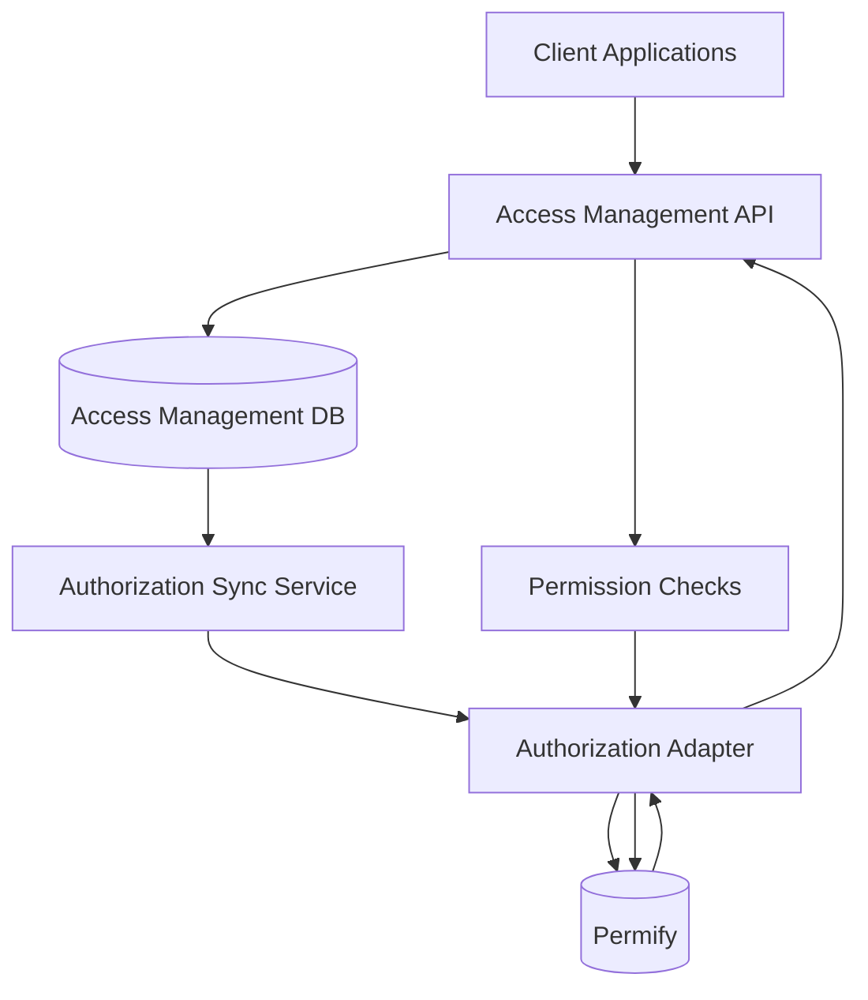
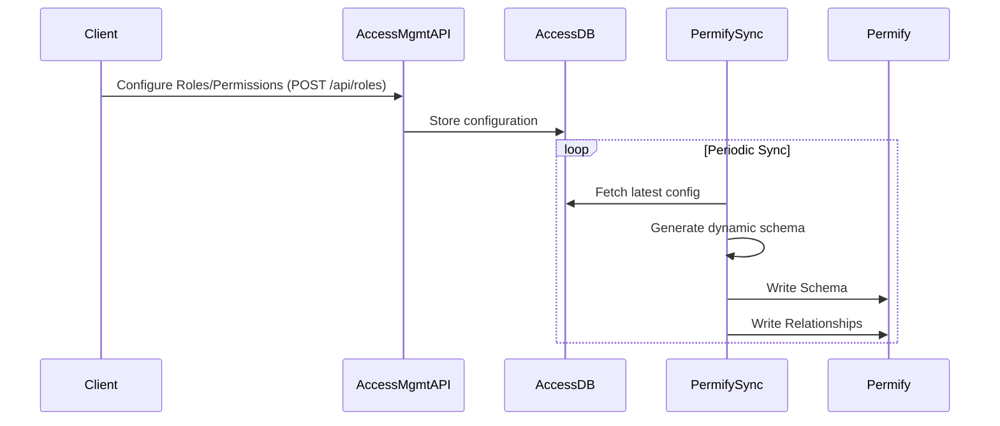
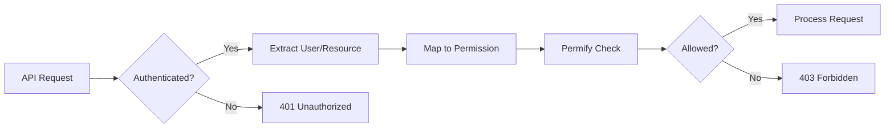
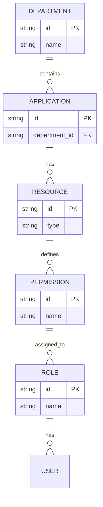
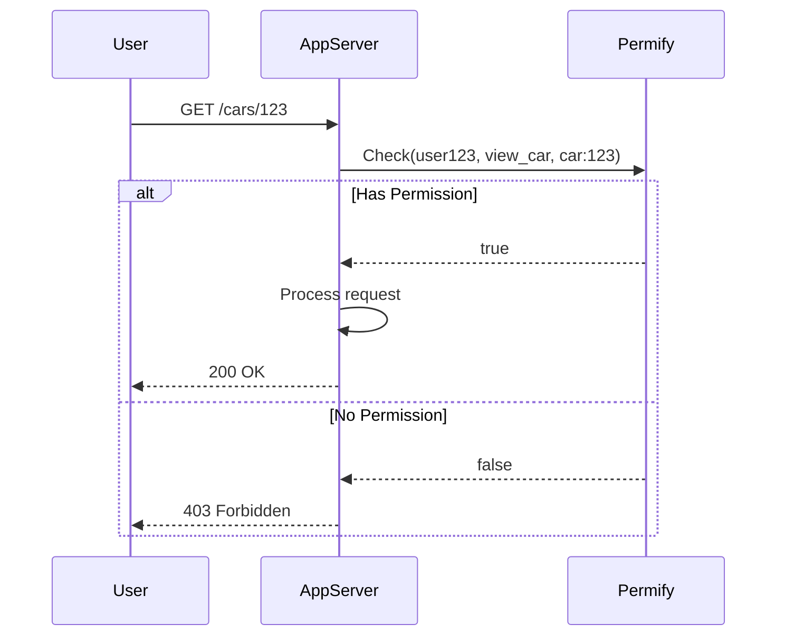
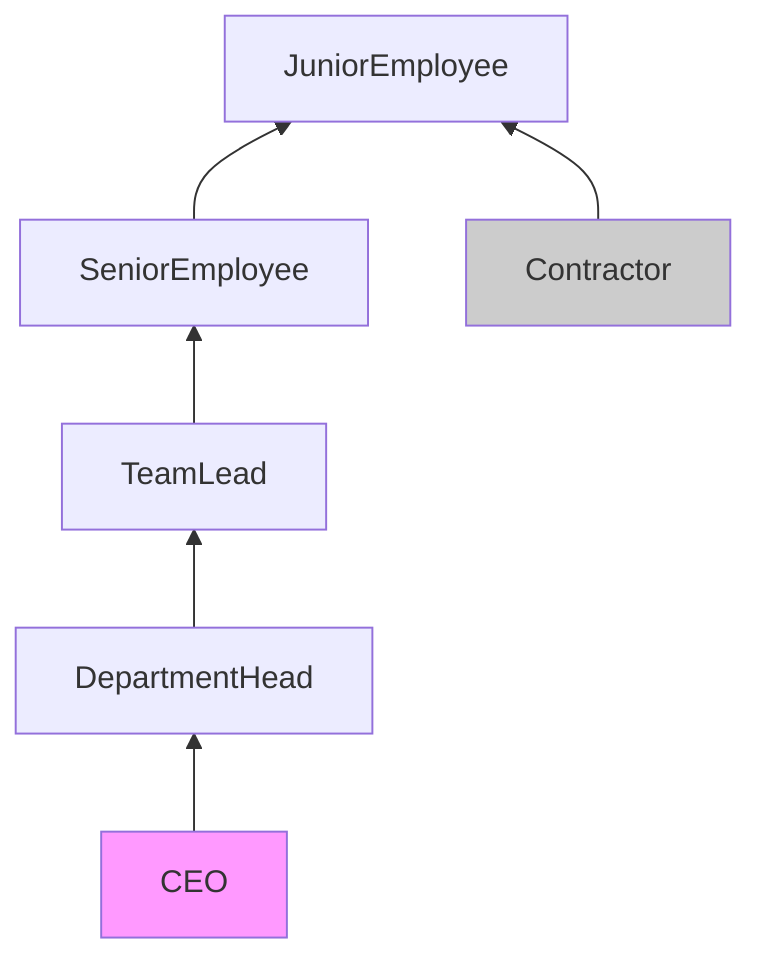
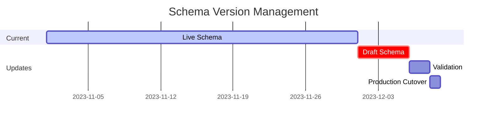

# iGRP Framework Auth Permify Specification - Dynamic Role-Based Access Control (RBAC) with Permify

## Version History

| Version | Author            | Date       | Changes                                        |
|---------|-------------------|------------|------------------------------------------------|
| 1.0.0   | @Marcelo.Monteiro | 2025-07-11 | Initial documentation for version 0.0.1-alpha. |
| ...     | ...               | ...        | ...                                            |

## Table of Contents

[[_TOC_]]

## Architecture Overview

This system dynamically maps access control configurations from the iGRP Access Management API to Permify's authorization system, supporting:

- **Fully dynamic roles**
- **Client-defined permission structures**
- **Real-time permission checks**
- **Automatic schema synchronization**



**Flow Explanation**:
1. Client applications (Car Management, HR System, etc.) configure their access rules through the Access Management API via iGRP App Center
2. Configurations are stored in the Access Management Database
3. Permify Sync Service dynamically generates schemas and relationships
4. Permify serves as the centralized authorization engine
5. Client apps perform real-time permission checks against Permify via Access Management check permission endpoint

---

## Dynamic Schema Generation Flow



**Key Steps**:
1. Clients define their custom roles and permissions via API
2. Configuration stored in database
3. Sync service periodically (or after any access configuration change):
   - Pulls latest configuration
   - Generates Permify-compatible schema
   - Pushes updates to Permify

---

## Permission Check Flow



**Decision Points**:
1. Authentication verified first
2. System maps request to dynamic permission key
3. Permify evaluates against current relationships
4. Access granted or denied based on live configuration

---

## Data Model Relationship



**Model Explanation**:
- Departments contain multiple applications
- Applications define multiple resources
- Resources have multiple permissions
- Permissions are assigned to roles
- Roles are assigned to users

---

## Runtime Authorization Sequence



**Error Cases**:
- `401 Unauthorized`: Missing/invalid credentials
- `403 Forbidden`: Valid credentials but insufficient permissions
- `404 Not Found`: Permission mapping doesn't exist

---

## Dynamic Role Inheritance



**Inheritance Rules**:
1. Arrows indicate "inherits permissions from"
2. Custom roles can be inserted at any level
3. Mixins supported (like Contractor)
4. Evaluated recursively during permission checks

---

## Schema Update Process

```
TODO: to be reviewed
```



**Version Control**:
1. Current schema remains active during updates
2. New schemas validated before deployment
3. Zero-downtime cutover to new versions
4. Rollback capability maintained

## Java Implementation

### 1. Dynamic Schema Synchronization

```
NOTE: this is just a generic implementation for reference
```

```java
@Service
public class DynamicPermifySyncService {

    private final PermifyClient permifyClient;
    private final AccessManagementRepository amRepo;

    public void syncFullAuthorizationModel(String tenantId) {
        // 1. Get all dynamic configurations from access management DB
        List<Department> departments = amRepo.findAllDepartments(tenantId);
        List<Application> applications = amRepo.findAllApplications(tenantId);
        List<DynamicRole> roles = amRepo.findAllRoles(tenantId);
        List<Resource> resources = amRepo.findAllResources(tenantId);
        List<PermissionDefinition> permissions = amRepo.findAllPermissions(tenantId);

        // 2. Build dynamic schema
        Schema.Builder schemaBuilder = Schema.newBuilder()
            .addEntities(createBaseEntities())
            .addEntities(createDepartmentEntities(departments))
            .addEntities(createRoleEntities(roles))
            .addEntities(createResourceEntities(resources, permissions));

        // 3. Write schema to Permify
        permifyClient.writeSchema(schemaBuilder.build());

        // 4. Sync all relationships
        syncAllRelationships(tenantId, departments, applications, roles, resources);
    }

    private List<EntityDefinition> createBaseEntities() {
        return List.of(
            EntityDefinition.newBuilder()
                .name("user")
                .build()
        );
    }

    private List<EntityDefinition> createDepartmentEntities(List<Department> departments) {
        // Departments get dynamic admin relations based on configured roles
        return departments.stream()
            .map(dept -> EntityDefinition.newBuilder()
                .name("department:" + dept.getId())
                .addRelations(createDynamicRoleRelations(dept))
                .build())
            .collect(Collectors.toList());
    }

    private List<Relation> createDynamicRoleRelations(Department dept) {
        // Create relations for each role that has department-level permissions
        return amRepo.findRolesWithDepartmentPermissions(dept.getId()).stream()
            .map(role -> Relation.newBuilder()
                .name(role.getName().toLowerCase())
                .type("user")
                .build())
            .collect(Collectors.toList());
    }

    private List<EntityDefinition> createRoleEntities(List<DynamicRole> roles) {
        return roles.stream()
            .map(role -> EntityDefinition.newBuilder()
                .name("role:" + role.getId())
                .addRelations(
                    Relation.newBuilder()
                        .name("member")
                        .type("user")
                        .build())
                .build())
            .collect(Collectors.toList());
    }

    private List<EntityDefinition> createResourceEntities(List<Resource> resources, 
                                                       List<PermissionDefinition> permissions) {
        return resources.stream()
            .map(resource -> {
                EntityDefinition.Builder builder = EntityDefinition.newBuilder()
                    .name(resource.getType() + ":" + resource.getId())
                    .addRelation(
                        Relation.newBuilder()
                            .name("department")
                            .type("department:" + resource.getDepartmentId())
                            .build());

                // Add dynamic permissions for this resource
                permissions.stream()
                    .filter(p -> p.getResourceId().equals(resource.getId()))
                    .forEach(p -> builder.addPermission(
                        Permission.newBuilder()
                            .name(p.getName())
                            .expression(buildDynamicPermissionExpression(p))
                            .build()));

                return builder.build();
            })
            .collect(Collectors.toList());
    }

    private String buildDynamicPermissionExpression(PermissionDefinition permission) {
        // Dynamic expression combining roles and direct assignments
        List<String> conditions = new ArrayList<>();

        // Add role-based conditions
        permission.getRoleIds().forEach(roleId -> 
            conditions.add(String.format("role:%s#member", roleId)));

        // Add direct user assignments
        if (!permission.getDirectUserIds().isEmpty()) {
            conditions.add(permission.getDirectUserIds().stream()
                .map(userId -> String.format("user:%s", userId))
                .collect(Collectors.joining(" or ")));
        }

        return conditions.isEmpty() ? "deny" : String.join(" or ", conditions);
    }

    private void syncAllRelationships(String tenantId, 
                                    List<Department> departments,
                                    List<Application> applications,
                                    List<DynamicRole> roles,
                                    List<Resource> resources) {
        List<Relationship> relationships = new ArrayList<>();

        // Department relationships
        departments.forEach(dept -> {
            // Add department admins (from any role marked as admin)
            amRepo.findDepartmentAdmins(dept.getId()).forEach(admin -> 
                relationships.add(Relationship.newBuilder()
                    .entity("department:" + dept.getId())
                    .relation("admin")
                    .subject("user:" + admin.getUserId())
                    .build()));

            // Add role assignments to departments
            amRepo.findDepartmentRoleAssignments(dept.getId()).forEach(assignment ->
                relationships.add(Relationship.newBuilder()
                    .entity("department:" + dept.getId())
                    .relation(assignment.getRoleName().toLowerCase())
                    .subject("user:" + assignment.getUserId())
                    .build()));
        });

        // Role memberships
        roles.forEach(role -> 
            amRepo.findRoleMembers(role.getId()).forEach(userId ->
                relationships.add(Relationship.newBuilder()
                    .entity("role:" + role.getId())
                    .relation("member")
                    .subject("user:" + userId)
                    .build())));

        // Resource-department relationships
        resources.forEach(resource ->
            relationships.add(Relationship.newBuilder()
                .entity(resource.getType() + ":" + resource.getId())
                .relation("department")
                .subject("department:" + resource.getDepartmentId())
                .build()));

        // Write all relationships
        permifyClient.writeRelationships(relationships);
    }
}
```

### 2. Permission Check Service

```
NOTE: this is just a generic implementation for reference
```

```java
@Service
public class DynamicPermissionService {

    private final PermifyClient permifyClient;
    private final AccessManagementRepository amRepo;

    public boolean checkDynamicPermission(String userId, 
                                        String resourceType,
                                        String resourceId, 
                                        String action) {
        // 1. Find the specific permission required for this action
        PermissionDefinition permission = amRepo.findPermission(resourceType, resourceId, action);
        
        if (permission == null) {
            return false; // No permission defined for this action
        }

        // 2. Check using the dynamic permission name
        return permifyClient.check(
            CheckRequest.newBuilder()
                .setUser("user:" + userId)
                .setPermission(permission.getName())
                .setResource(resourceType + ":" + resourceId)
                .build()
        ).getCan();
    }
}
```

### 3. API Interceptor with Dynamic Roles

```
NOTE: this is just a generic implementation for reference
```

```java
@RestControllerAdvice
public class DynamicPermissionInterceptor implements HandlerInterceptor {

    @Autowired
    private DynamicPermissionService permissionService;

    @Override
    public boolean preHandle(HttpServletRequest request,
                            HttpServletResponse response,
                            Object handler) throws Exception {
        
        // Extract context
        String userId = extractUserId(request);
        String resourcePath = request.getRequestURI();
        String httpMethod = request.getMethod();
        String resourceType = determineResourceType(resourcePath);

        // Map to dynamic permission
        String requiredPermission = amRepo.findRequiredPermission(
            resourceType, 
            resourcePath, 
            httpMethod
        );

        if (requiredPermission == null) {
            response.sendError(HttpStatus.NOT_FOUND.value(), "No permission mapping found");
            return false;
        }

        if (!permissionService.checkDynamicPermission(userId, resourceType, resourcePath, requiredPermission)) {
            response.sendError(HttpStatus.FORBIDDEN.value(), 
                String.format("Requires permission: %s", requiredPermission));
            return false;
        }

        return true;
    }
}
```

## Example Scenario: Car Management App

### Access Management Configuration

1. **Department Setup**:
   - Name: "XPTO Automotive"
   - ID: `dept_auto`
   - Configured Roles: ["fleet_manager", "vehicle_operator", "maintenance_tech"]

2. **Resource Setup**:
   - Type: "vehicle"
   - Permissions: ["view_vehicle", "operate_vehicle", "maintain_vehicle"]

3. **Role-Permission Assignments**:
   - `fleet_manager`: All permissions
   - `vehicle_operator`: ["view_vehicle", "operate_vehicle"]
   - `maintenance_tech`: ["view_vehicle", "maintain_vehicle"]

### Generated Permify Schema

```perm
entity user {}

entity department:dept_auto {
    relation admin @user
    relation fleet_manager @user
    relation vehicle_operator @user
    relation maintenance_tech @user
}

entity role:fleet_manager {
    relation member @user
}

entity role:vehicle_operator {
    relation member @user
}

entity role:maintenance_tech {
    relation member @user
}

entity vehicle {
    relation department @department:dept_auto
    
    permission view_vehicle = 
        department.fleet_manager or
        department.vehicle_operator or 
        department.maintenance_tech or
        role:fleet_manager#member or
        role:vehicle_operator#member or
        role:maintenance_tech#member
    
    permission operate_vehicle = 
        department.fleet_manager or
        department.vehicle_operator or
        role:fleet_manager#member or
        role:vehicle_operator#member
    
    permission maintain_vehicle = 
        department.fleet_manager or
        department.maintenance_tech or
        role:fleet_manager#member or
        role:maintenance_tech#member
}
```

### Scenario 1: Authorized Access

**Request:**
```
POST /vehicles/ABC123/start
Headers:
  Authorization: Bearer <operator_jwt>
```

**Flow:**
1. Interceptor identifies:
   - User: "user456"
   - Resource: "vehicle:ABC123"
   - Action: "operate_vehicle"

2. Checks Permify relationships:
   ```
   department:dept_auto#vehicle_operator@user:user456
   ```

3. Evaluation:
   - `vehicle:ABC123#operate_vehicle` requires:
      - `department:dept_auto#vehicle_operator` → TRUE
   - Returns `true`

4. Result: 200 OK

### Scenario 2: Unauthorized Access

**Request:**
```
POST /vehicles/ABC123/maintenance
Headers:
  Authorization: Bearer <operator_jwt>
```

**Flow:**
1. Interceptor identifies:
   - User: "user456"
   - Resource: "vehicle:ABC123"
   - Action: "maintain_vehicle"

2. Checks Permify relationships:
   ```
   department:dept_auto#vehicle_operator@user:user456
   ```

3. Evaluation:
   - `vehicle:ABC123#maintain_vehicle` requires:
      - `department:dept_auto#maintenance_tech` → FALSE
      - `role:maintenance_tech#member` → FALSE
   - Returns `false`

4. Result: 403 Forbidden with message:
   ```json
   {
     "error": "Requires permission: maintain_vehicle",
     "required_roles": ["maintenance_tech", "fleet_manager"]
   }
   ```

## Dynamic Relationship Examples

1. **User with Multiple Roles**:
   ```java
   // user789 is both fleet_manager and maintenance_tech
   relationships.addAll(List.of(
       Relationship.newBuilder()
           .entity("department:dept_auto")
           .relation("fleet_manager")
           .subject("user:user789")
           .build(),
       Relationship.newBuilder()
           .entity("role:fleet_manager")
           .relation("member")
           .subject("user:user789")
           .build(),
       Relationship.newBuilder()
           .entity("department:dept_auto")
           .relation("maintenance_tech")
           .subject("user:user789")
           .build()
   ));
   ```

2. **Resource-Specific Overrides**:
   ```java
   // Allow user999 to operate specific vehicle despite not having role
   relationships.add(
       Relationship.newBuilder()
           .entity("vehicle:DEF456")
           .relation("operate_vehicle")
           .subject("user:user999")
           .build()
   );
   ```

This implementation provides:
- Complete flexibility in role naming and structure
- Dynamic permission definitions per resource type
- Hybrid authorization (role-based + direct assignments)
- Real-time permission checking
- Automatic schema updates when configurations change